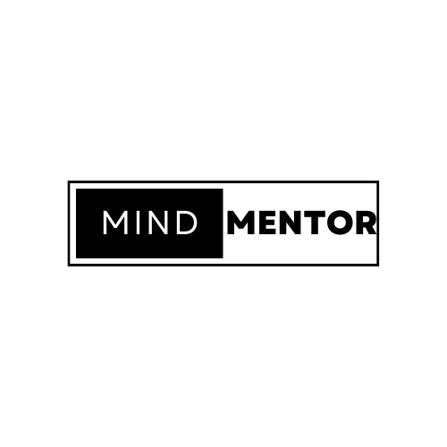
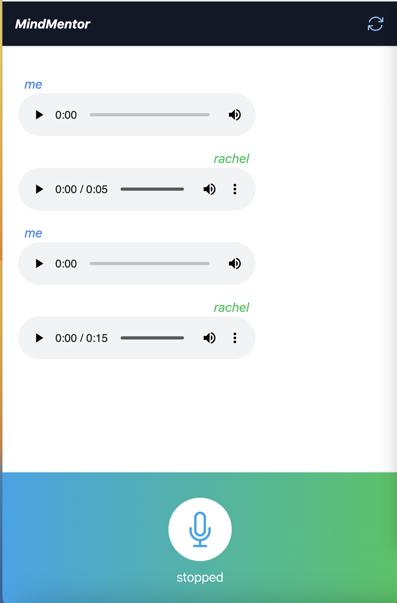

# MindMentor: AI Voicebot Mental Consultant 🤖

## Project Description
MindMentor is an AI-powered voicebot designed to offer mental health consultations. The voicebot aims to provide immediate, confidential support for individuals seeking mental well-being.

## Demo

## Technologies Used
- Frontend: React, TypeScript, EM6
- Backend: FastAPI
- Voice Recognition and Response: ChatGPT, Eleven Labs
- APIs: OpenAI's Whisper

## MVP Features
- Voice Recognition
- Consultation

<!-- ## Stretch Goals
- User Authentication
- Mental Health Assessment
- Mindfulness Exercises
- Feedback Loop
- Multi-language Support
- Advanced Analytics
- Integration with Wearables
- Telehealth Integration
- Community Forum -->

## License
This project is licensed under the MIT License 

## Acknowledgements
- OpenAI for their Whisper API
- Eleven Labs for their voice recognition technology

## Contact Information
For any further queries, please contact [Amanda Guan](mailto:ag.amandaguan@gmail.com).